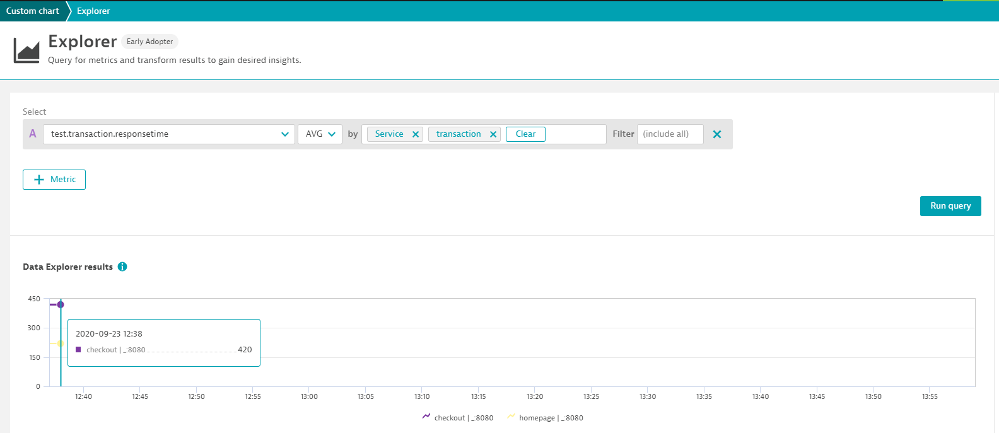

# Dynatrace Automation Samples

## 1. Metric Ingest for Testing Tools

The new Dynatrace Metric Ingest API allows us to send any type of multi-dimensional metrics. The dimensions can also include dynatrace entities such as host, service, progress group ... which allows us to send metrics to existing Dynatrace entities.
This is in particular interest for testing tools such as load testing tools that can send their test metrics as well as transaction metrics to Dynatrace.

The script loadtest_metricingest.sh shows how to use that metric ingest API. It requires a DT_API_TOKEN, DT_TENANT and DT_SERVICE_ID

```
export DT_API_TOKEN=YOURTOKEN
export DT_TENANT=abc12312.live.dynatrace.com
export DT_SERVICE_ID=SERVICE-B021B9B139D8D7BB
./loadtesting_metricingest.sh
```

the script creates a payload.txt where you can see the payload for the REST Call in detail. But - best is to simply look into loadtesting_metricingest.sh to see how the API works.

Once the data is in Dynatrace you can use the new Metric explorer to create charts:
